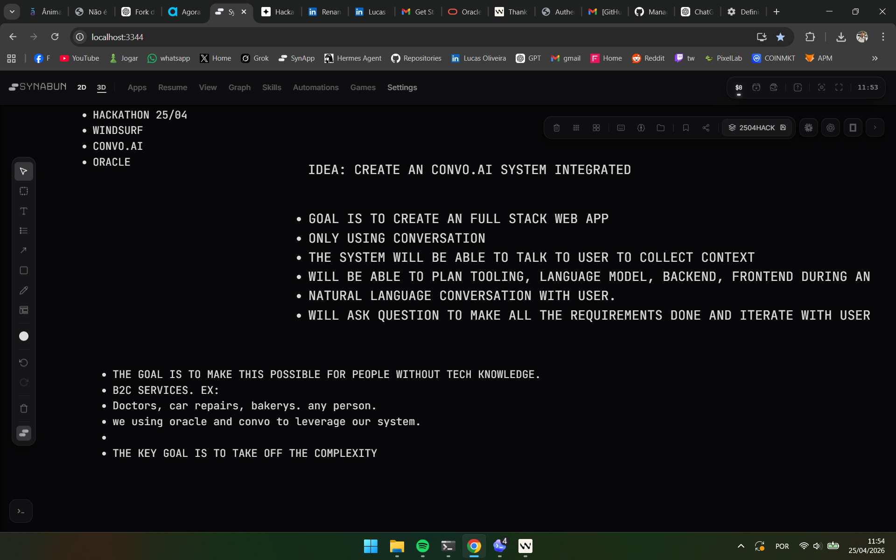

<p align="center">
  
</p>

# Fluxo Visual — SIMPLE-AI

> Diagramas e fluxos do produto para entendimento rapido.

---

## Fluxo Completo do Usuario

```
+==========================================+
|            USUARIO CHEGA                 |
|   (nao sabe nada de tecnologia)          |
+==========================================+
                    |
                    v
+------------------------------------------+
|          SIMPLE-AI PERGUNTA:             |
|  "Me conta o que voce faz e o que        |
|   voce precisa. Fala do jeito que        |
|   vier na cabeca."                       |
+------------------------------------------+
                    |
                    v
+------------------------------------------+
|         USUARIO RESPONDE                 |
|  (texto livre ou voz)                    |
|                                          |
|  ex: "Tenho uma oficina e quero que      |
|       as pessoas peçam orcamento         |
|       pelo WhatsApp"                     |
+------------------------------------------+
                    |
                    v
+------------------------------------------+
|      AGENTE ANALISA E EXTRAI             |
|                                          |
|  business_type: "Oficina mecanica"       |
|  primary_cta:   "orcamento WhatsApp"     |
|  brand_name:     ???                     |
|  confidence:     35%                     |
+------------------------------------------+
                    |
                    v
+------------------------------------------+
|     LOOP: PERGUNTA --> RESPOSTA          |
|                                          |
|  "Qual o nome do seu negocio?"           |
|  --> "Auto Center Silva"                 |
|                                          |
|  "Para quem e esse site?"               |
|  --> "Donos de carro da regiao"          |
|                                          |
|  (lousa atualiza a cada resposta)        |
+------------------------------------------+
                    |
                    v
+------------------------------------------+
|       CAMPOS CRITICOS COMPLETOS          |
|                                          |
|  OK  Nome: Auto Center Silva             |
|  OK  Tipo: Oficina mecanica              |
|  OK  CTA: Pedir orcamento               |
|  OK  Canal: WhatsApp                     |
|  OK  Publico: Donos de carro             |
|                                          |
|  --> ready_to_build = true               |
+------------------------------------------+
                    |
                    v
+------------------------------------------+
|         AGENTE PROPOE GERAR             |
|                                          |
|  "Ja tenho uma boa ideia do que voce     |
|   precisa! Posso montar uma primeira     |
|   versao agora."                         |
+------------------------------------------+
                    |
                    v
+------------------------------------------+
|        GPT-4o GERA O SITE               |
|                                          |
|  HTML auto-contido com:                  |
|  - Hero section + CTA                   |
|  - Lista de servicos                    |
|  - Secao sobre o negocio               |
|  - Botao de WhatsApp                    |
|  - Mapa (se escopo local)              |
|  - Design responsivo                    |
+------------------------------------------+
                    |
                    v
+==========================================+
|         SITE PRONTO!                     |
|  [Abrir preview]  [Link publico]         |
|                                          |
|  "Quer mudar alguma coisa?              |
|   E so falar."                           |
+==========================================+
```

---

## As 3 Macro-Fases

```
+------------------+      +------------------+      +------------------+
|   DISCOVERY      |      |   PRODUCAO       |      |   ITERACAO       |
|                  |      |                  |      |                  |
|  Conversa        | ---> |  Decisoes        | ---> |  Feedback        |
|  natural         |      |  automaticas     |      |  do usuario      |
|                  |      |                  |      |                  |
|  Coleta dados    |      |  Stack           |      |  "Muda a cor"    |
|  do negocio      |      |  Layout          |      |  "Tira isso"     |
|  via perguntas   |      |  Modulos         |      |  "Ta otimo!"     |
|  simples         |      |  Conteudo        |      |                  |
|                  |      |  Gera HTML       |      |  Aplica e        |
|  Uma pergunta    |      |                  |      |  mostra nova     |
|  por vez         |      |  Tudo silencioso |      |  versao          |
+------------------+      +------------------+      +------------------+
```

---

## Decisoes que o Agente Toma Sozinho

O usuario **nunca** ve estas decisoes. O agente resolve internamente:

```
Respostas do usuario
        |
        v
+-- Qual template? --------+
|                          |
|  Loja/produto --> product-showcase-lite
|  Clinica/prof --> professional-trust
|  Servico      --> service-clean
|                          |
+-- Quais secoes? ---------+
|                          |
|  Sempre: Hero + Contato
|  Se tem offerings: Servicos
|  Se escopo local: Mapa
|  Se WhatsApp: Botao flutuante
|  Se tem fotos: Galeria
|  Se tem FAQ: FAQ
|                          |
+-- Qual estilo? ----------+
|                          |
|  Tom serio   --> serif, cores neutras
|  Tom jovem   --> sans, cores vibrantes
|  Tom acolhedor --> rounded, cores quentes
|                          |
+--------------------------+
        |
        v
  Site gerado sem o usuario
  saber que essas decisoes
  foram tomadas
```

---

## Personas de Teste

```
+---------------------------+---------------------------+---------------------------+
|  JULIANA, 34              |  CARLOS, 41               |  SEU ANTONIO, 68          |
|  Dona de atelie           |  Consultor                |  Aposentado               |
|                           |                           |                           |
|  Quer vender online       |  Precisa de landing page  |  Quer divulgar            |
|  Nao tem budget           |  Sabe o que comunicar     |  servico de jardinagem    |
|  Usa WhatsApp pra tudo    |  Nao sabe HTML            |  So usa WhatsApp          |
|                           |  Odeia perder tempo       |                           |
|  SIMPLE-AI: perfeito      |  SIMPLE-AI: perfeito      |  Se ele consegue usar,    |
|  pra ela                  |  pra ele                  |  QUALQUER PESSOA          |
|                           |                           |  consegue.                |
+---------------------------+---------------------------+---------------------------+
```

---

## Plano de Referencia do Projeto

<p align="center">
  
</p>

---

<p align="center">
  <em>Volte para o <a href="README.md">README principal da apresentacao</a>.</em>
</p>
