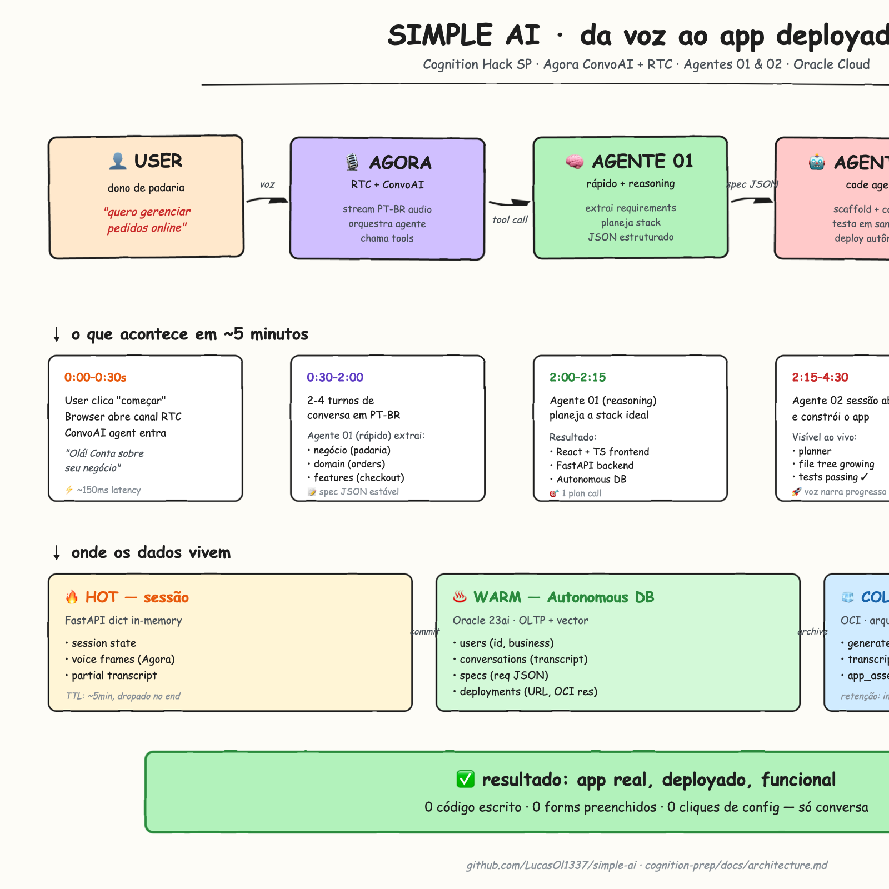
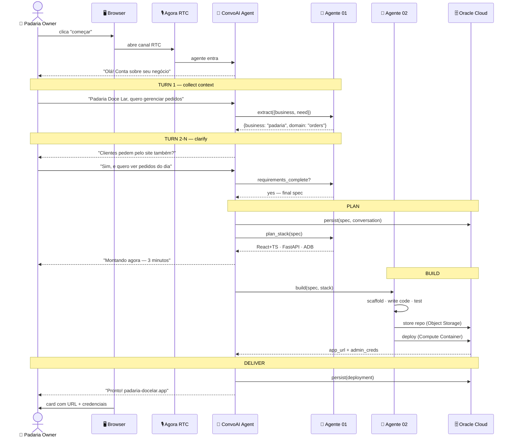

# Simple AI — Visual Data Architecture

> **Vision:** see [README](../README.md)
> **Hackathon:** Cognition Hack SP, 2026-04-25 — tracks: Agora ConvoAI + RTC + Oracle Cloud + autonomous code agent



---

## 1. Concept (1 paragraph)

**Simple AI** is a conversational full-stack app builder for **non-tech SMB owners** — doctors, bakers, mechanics, hairdressers. The user speaks Portuguese into the browser. The system collects business context, asks clarifying questions, plans the stack, generates the app via an autonomous code agent, deploys it on Oracle Cloud, and hands back a working URL. **The user never writes code or fills a form. They just talk.**

Key insight: ConvoAI removes UI as a barrier. Agente 02 removes coding. OCI removes ops. Together they remove **the entire technical chasm** between "I have an idea" and "my app is live."

---

## 2. High-Level System Architecture

```mermaid
flowchart TB
    subgraph User["👤 USER LAYER"]
        U["Non-tech SMB owner<br/>doctor · baker · mechanic"]
        B["Browser<br/>mic + live progress dashboard"]
    end

    subgraph Voice["🎙️ VOICE LAYER · Agora"]
        RTC["Agora RTC<br/>WebRTC audio · PT-BR"]
        CVA["Agora ConvoAI<br/>conversation orchestration<br/>tool callbacks"]
    end

    subgraph AI["🧠 AI LAYER · Anthropic + Cognition"]
        H["Agente 01 (rápido)<br/>intent + entity extraction<br/>~500ms"]
        S["Agente 01 (reasoning)<br/>architecture planning<br/>requirements review"]
        D["Agente 02 (code agent)<br/>multi-step code gen<br/>tests + deploy"]
    end

    subgraph Cloud["☁️ ORACLE CLOUD INFRASTRUCTURE"]
        ADB[("Autonomous DB 23ai<br/>conversations · specs<br/>users · deployments")]
        OS[("Object Storage<br/>generated code · audio<br/>assets")]
        OK["OCI Compute / Container<br/>runs deployed user apps"]
    end

    U <-->|voice| B
    B <-->|WebRTC SDK| RTC
    RTC <-->|audio frames| CVA
    CVA -->|tool: extract_intent| H
    CVA -->|tool: plan_stack| S
    CVA -->|tool: build_app| D
    H --> CVA
    S --> CVA
    D -->|writes repo| OS
    D -->|deploys runtime| OK
    CVA -->|persist conversation| ADB
    OK -->|app URL| B

    style User fill:#1a1a2e,stroke:#e94560
    style Voice fill:#16213e,stroke:#0f3460
    style AI fill:#0f3460,stroke:#533483
    style Cloud fill:#533483,stroke:#e94560
```



---

## 3. Data Flow — User Journey

The padaria owner gets a working order-management app in ~5 minutes of conversation.



---

## 4. Data Storage Map

Where each piece of data lives, and for how long.

```mermaid
flowchart LR
    subgraph Hot["🔥 HOT · in-memory · session"]
        SS["Session state<br/>FastAPI dict<br/>~5min TTL"]
        VS["Voice frames<br/>Agora ephemeral<br/>not persisted"]
    end

    subgraph Warm["♨️ WARM · Oracle Autonomous DB · per user"]
        T1["users<br/>id · email · business · created_at"]
        T2["conversations<br/>session_id · transcript<br/>turns_jsonb · status"]
        T3["specs<br/>requirements_json<br/>stack_json · approved_at"]
        T4["deployments<br/>app_url · oci_resources<br/>creds_secret_id · status"]
    end

    subgraph Cold["🧊 COLD · Object Storage · archive"]
        F1["generated_code/<br/>{user_id}/{spec_id}.zip"]
        F2["transcripts/<br/>{session_id}.json + .wav"]
        F3["app_assets/<br/>{deployment_id}/logo.png ..."]
    end

    Hot -->|"on session_end<br/>(commit transcript + spec)"| Warm
    Warm -->|"on deploy_complete<br/>(snapshot artifacts)"| Cold

    style Hot fill:#7a3b00
    style Warm fill:#0a4d3a
    style Cold fill:#1e3a5f
```



---

## 5. Tech Stack Mapping

| Layer | Tech | Why this |
|---|---|---|
| Voice transport | **Agora RTC Web SDK** | Mandatory track; PT-BR voice |
| Conversation orchestration | **Agora ConvoAI** | Mandatory track; managed agent + tool callbacks |
| Fast intent / NER | **Agente 01 (modelo rápido)** | <500ms PT-BR; tool-use pattern |
| Heavy reasoning | **Agente 01 (reasoning model)** | stack planning, requirements review |
| Autonomous code gen | **Agente 02 (code agent)** | multi-step build, sandbox, tests, deploy — single thing no plain LLM does |
| OLTP + vector | **Oracle Autonomous DB 23ai** | OCI track; `VECTOR_DISTANCE` for spec retrieval |
| Artifacts | **OCI Object Storage** | code zips · audio · assets |
| Runtime | **OCI Compute / Container Instances** | runs user-generated apps on free tier |
| Frontend | **React 19 + Vite + Tailwind + shadcn/ui** | fast scaffold, clean demo |
| Backend orchestrator | **FastAPI + asyncio + SSE** | async, streams progress to UI |

---

## 6. Critical Path · what must work for the demo

```mermaid
flowchart LR
    A[👤 user voice] --> B{Agora RTC<br/>connected?}
    B -- no --> X1[❌ kill]
    B -- yes --> C{ConvoAI agent<br/>responding?}
    C -- no --> X2[❌ kill]
    C -- yes --> D{Agente 01 tool calls<br/>JSON valid?}
    D -- no --> X3[fallback: text path]
    D -- yes --> E{OCI ADB<br/>persisting?}
    E -- no --> X4[fallback: mock]
    E -- yes --> F{Agente 02 session<br/>live?}
    F -- no --> X5[show plan only]
    F -- yes --> G[✅ deployed URL]

    style X1 fill:#7a0000
    style X2 fill:#7a0000
    style X3 fill:#7a3b00
    style X4 fill:#7a3b00
    style X5 fill:#7a3b00
    style G fill:#0a4d3a
```



Each gate has a fallback. We validate **every gate green** before the hackathon starts.

---

## 7. What this architecture is NOT (anti-scope)

- **Not** a code editor (user never sees code)
- **Not** multi-tenant for prod-grade security at this stage (1 hardcoded test user OK for hackathon)
- **Not** a marketplace of templates (Agente 02 generates fresh each time)
- **Not** a chatbot (it's an _outcome-oriented_ conversation that ends with a deployed app)

---

## 8. Demo flow · 3 minutes

| t | Beat | Visible |
|---|---|---|
| 0:00 | Hook: "padaria, oficina, consultório — todos sofrem com sistema" | Logo + 1 line |
| 0:20 | Volunteer judge speaks: "sou dentista, quero agenda online" | Voice waveform · ConvoAI transcript live |
| 0:40 | ConvoAI faz 2-3 perguntas, refina spec | Right-side panel: spec emerging in JSON |
| 1:20 | "Montando agora" — Agente 02 sessão abre | Painel: planner → file tree → tests passing |
| 2:30 | Deployed URL aparece, narra | Card com URL clicável + credenciais admin |
| 2:50 | Click no URL: app real do dentista funcionando | Live preview |
| 3:00 | Close: "0 código, 0 cliques, 1 conversa" | URL na tela |

---

## 9. Pre-event integration validation

Before the 4h build window, each integration is validated end-to-end:

```
✓ OCI auth + 5 ops (list instances, ADB, billing, buckets, SQL)
✓ Agora RTC token gen + voice channel
✓ Agora ConvoAI agent + tool callback
✓ Agente 01 tool-use JSON pattern
✓ Agente 02 session lifecycle
✓ End-to-end voice → intent → OCI → response

      ▼   no hackathon day, repo fresh, build em 4h
      ▼   reaproveita modelo mental · re-implementa rápido

simple-ai/  (the actual submission)
├── frontend/   Vite + React + Agora RTC SDK
├── backend/    FastAPI · ConvoAI tool webhooks · code-agent client
└── infra/      .oci/config · ADB schema · deployment scripts
```
