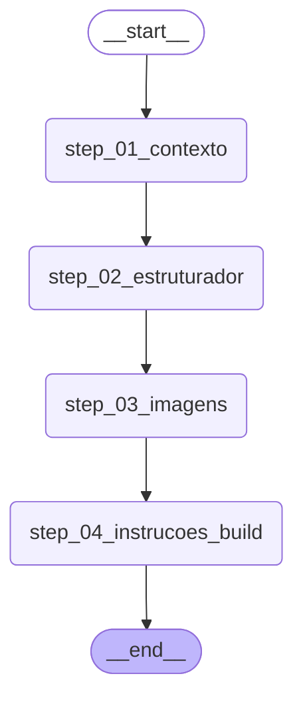

# LangGraph V2 Flow — Visualization

Generated from `LangGraphFluxoOrchestrator._build_graph()` in `api/fluxo/langgraph_orchestrator.py`.

## How to view

- **VS Code**: install "Markdown Preview Mermaid Support" extension, then open this file with `Cmd+Shift+V`.
- **GitHub**: renders Mermaid natively when this file is committed.
- **Online**: paste the mermaid block at https://mermaid.live to inspect/edit.

## What it shows

Linear chain: `START → step_01_contexto → step_02_estruturador → step_03_imagens → step_04_instrucoes_build → END`.

Each node delegates to the matching `FluxoOrchestrator._step_*` method (V1 logic, unchanged). v0.1 of V2 is a 1:1 wrap. Future versions can replace any edge with conditional routing or parallel fan-out without touching the node implementations.
